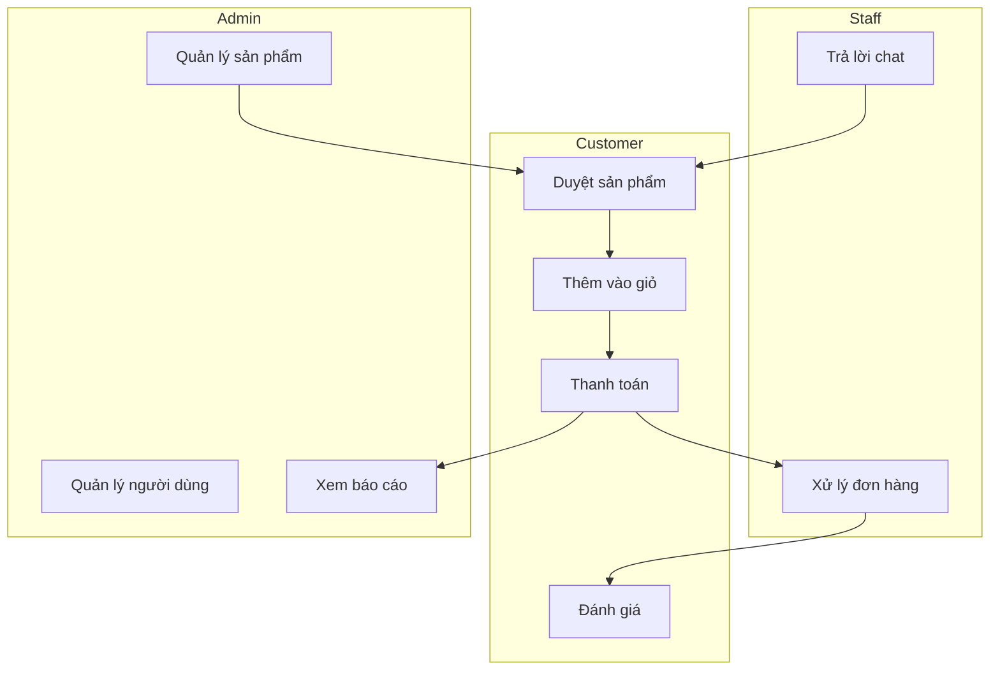
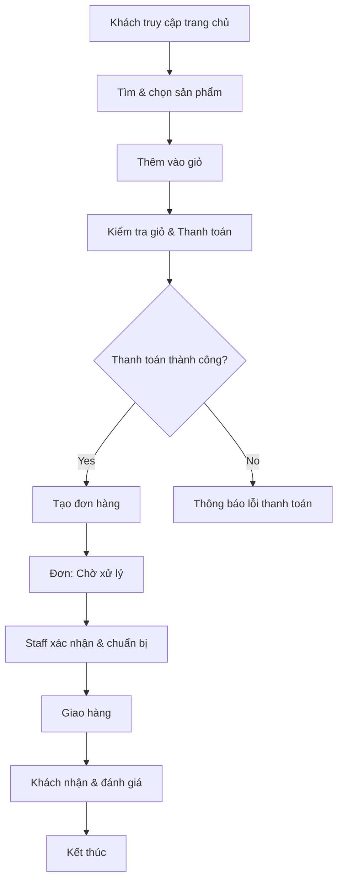

[//]: # (File hoàn chỉnh mô tả hệ thống - cập nhật đầy đủ theo yêu cầu)

# Tên đề tài: Hệ thống Quản lý Ngọc Thiện Wedding

## Thành viên nhóm
- Nguyễn Văn A - MSSV: 123456 - Vai trò: Thành viên
- Trần Thị B - MSSV: 234567 - Vai trò: Thành viên
- Lê Văn C - MSSV: 345678 - Vai trò: Thành viên

> Ghi chú: Thay thế tên và MSSV bằng thông tin thực tế của nhóm trước khi nộp.

---

## 1. Mục tiêu tổng quan

Hệ thống Quản lý Ngọc Thiện Wedding là một ứng dụng web thương mại điện tử chuyên kinh doanh các sản phẩm, dịch vụ cưới (váy cưới, phụ kiện, dịch vụ trang trí, thuê áo cưới, v.v.). Mục tiêu:
- Hỗ trợ khách hàng tìm kiếm, đặt mua và thanh toán trực tuyến.
- Hỗ trợ nhân viên xử lý đơn, quản lý kho và giao hàng.
- Cung cấp giao diện quản trị cho Admin quản lý sản phẩm, người dùng và nội dung trang.
- Lưu trữ lịch sử giao dịch, tin nhắn tư vấn và báo cáo doanh thu.

## 2. Phạm vi chức năng (Scope)

- Giao diện khách hàng: duyệt sản phẩm, giỏ hàng, thanh toán, đánh giá, chat hỗ trợ.
- Giao diện nhân viên: quản lý đơn hàng, xử lý hoàn trả, liên hệ khách hàng.
- Giao diện Admin: quản lý sản phẩm/danh mục, quản lý người dùng/role, cấu hình trang chủ, xem báo cáo.
- Hệ thống backend/API: xác thực, thao tác CRUD cho sản phẩm/đơn hàng/người dùng, lưu trữ chat, tích hợp thanh toán.

## 3. Chức năng chính (Chi tiết)

1) Quản lý sản phẩm
  - Thêm/sửa/xóa sản phẩm (tên, mô tả, giá, hình ảnh, danh mục, trạng thái).
  - Quản lý danh mục và tag.
  - Quản lý tồn kho (số lượng) và hiển thị trạng thái "Còn hàng"/"Hết hàng".

2) Giỏ hàng & Thanh toán
  - Thêm/sửa/xóa sản phẩm trong giỏ.
  - Tính tiền tạm, phí vận chuyển, giảm giá (coupon).
  - Các phương thức thanh toán: chuyển khoản, COD, tích hợp cổng thanh toán (tùy chọn).

3) Quản lý đơn hàng
  - Tạo đơn khi khách thanh toán thành công.
  - Trạng thái đơn: Mới → Xác nhận → Đang xử lý → Đang giao → Hoàn thành → Hủy.
  - Lưu lịch sử trạng thái, in hóa đơn và gửi email/SMS xác nhận.

4) Quản lý người dùng & phân quyền
  - Đăng ký/đăng nhập (email, mật khẩu, OAuth nếu có).
  - Quản lý hồ sơ người dùng (địa chỉ, số điện thoại, lịch sử đơn).
  - Phân quyền: Admin, Staff, Customer.

5) Đánh giá & nhận xét
  - Khách hàng sau khi nhận hàng có thể đánh giá (sao + nội dung).
  - Quản lý, duyệt/ẩn bình luận (Admin).

6) Hỗ trợ trực tuyến (Live Chat)
  - Phiên chat giữa khách và nhân viên, lưu lịch sử.
  - Thông báo khi có tin nhắn mới, trạng thái online/offline.

7) Báo cáo & thống kê
  - Báo cáo doanh thu theo ngày/tháng/năm.
  - Danh sách sản phẩm bán chạy, lượt truy cập, tỉ lệ chuyển đổi.

8) Quản trị nội dung trang chủ
  - Quản lý banner, mục nổi bật, bài viết PR.

## 4. Phân quyền người dùng (Roles & Permissions)

- Admin
  - Quyền: Toàn quyền hệ thống — quản lý sản phẩm, đơn hàng, người dùng, nội dung, báo cáo.

- Staff (Nhân viên)
  - Quyền: Xem & cập nhật đơn hàng, trả lời chat, quản lý kho (theo phân quyền chi tiết).

- Customer (Khách hàng)
  - Quyền: Duyệt sản phẩm, đặt hàng, thanh toán, đánh giá, chat hỗ trợ.

Ghi chú: Triển khai hệ thống RBAC/ACL để gán quyền ở mức resource (ví dụ: product:create, order:update).

## 5. Các Use Case chính (Mô tả ngắn)

1. Mua hàng (Customer)
  - Actor: Customer
  - Mục tiêu: Hoàn tất mua 1 hoặc nhiều sản phẩm và thanh toán.
  - Luồng chính: Duyệt sản phẩm → Thêm giỏ → Thanh toán → Tạo đơn → Xác nhận → Giao hàng.

2. Xử lý đơn (Staff)
  - Actor: Staff
  - Mục tiêu: Xác nhận đơn, cập nhật trạng thái, liên hệ khách.

3. Quản trị hệ thống (Admin)
  - Actor: Admin
  - Mục tiêu: Quản lý sản phẩm, người dùng, nội dung, xem báo cáo.

## 6. Sơ đồ Use Case (Mermaid)


## 7. Luồng hoạt động chính (Flowchart)


## 8. Mô tả chi tiết luồng chính (từ bắt đầu đến hoàn thành chức năng chính)

1. Khách hàng truy cập trang web, duyệt hoặc tìm kiếm sản phẩm.
2. Khách chọn sản phẩm, kiểm tra thông tin (kích cỡ, màu, mô tả), thêm vào giỏ.
3. Khi khách tiến hành thanh toán, hệ thống kiểm tra thông tin giao hàng và phương thức thanh toán.
4. Hệ thống liên lạc với cổng thanh toán (nếu có). Nếu thanh toán thành công, hệ thống tạo đơn và gửi thông báo xác nhận qua email/SMS.
5. Đơn được đưa vào hàng đợi "Chờ xử lý"; nhân viên nhận thông báo, xác thực tồn kho và cập nhật trạng thái.
6. Khi đơn được đóng gói và bàn giao cho đơn vị vận chuyển, trạng thái chuyển sang "Đang giao".
7. Sau khi khách xác nhận nhận hàng, trạng thái chuyển sang "Hoàn thành"; khách được mời đánh giá sản phẩm.

## 9. Yêu cầu phi chức năng (Non-Functional)

- Bảo mật: mã hoá mật khẩu, bảo vệ API bằng JWT, kiểm soát truy cập RBAC.
- Hiệu năng: đáp ứng < 2s cho trang danh sách sản phẩm dưới tải nhẹ.
- Khả năng mở rộng: tách dịch vụ thanh toán, cache cho danh sách sản phẩm.
- Sao lưu: sao lưu cơ sở dữ liệu định kỳ (hàng ngày).

## 10. API / Data (tóm tắt)

- Các endpoint chính (ví dụ):
  - POST /api/auth/login
  - POST /api/auth/register
  - GET /api/products
  - GET /api/products/:id
  - POST /api/cart
  - POST /api/orders
  - GET /api/orders/:id
  - POST /api/chat/messages

## 11. Yêu cầu nộp & Hướng dẫn xuất Word/PDF

- Yêu cầu nộp: một (1) file tài liệu mô tả chức năng (Word hoặc PDF) kèm ảnh sơ đồ Use Case/Flowchart.
- Hướng dẫn nhanh chuyển Markdown -> PDF/Word:
  - Cách 1 (VS Code): Mở file `MOTA_HE_THONG.md`, sử dụng extension "Markdown PDF" hoặc in (Print) → chọn "Save as PDF".
  - Cách 2 (Pandoc):
```powershell
pandoc MOTA_HE_THONG.md -o MoTaHeThong.pdf
pandoc MOTA_HE_THONG.md -o MoTaHeThong.docx
```
  - Cách 3 (Typora): Mở và Export -> PDF/Word.

## 12. Ghi rõ tên đề tài và thành viên nhóm

- Đã có ở đầu tài liệu; nhớ cập nhật nếu có thay đổi.

---

Nếu bạn muốn, tôi có thể:
- Thay thế phần "Thành viên nhóm" bằng danh sách thực tế bạn cung cấp.
- Xuất file PDF/Word trực tiếp trong workspace (nếu cài Pandoc hoặc cho phép tôi tạo file `.docx`).

Vui lòng cho tôi danh sách thành viên thực tế để tôi cập nhật bản chính thức trước khi bạn nộp.
